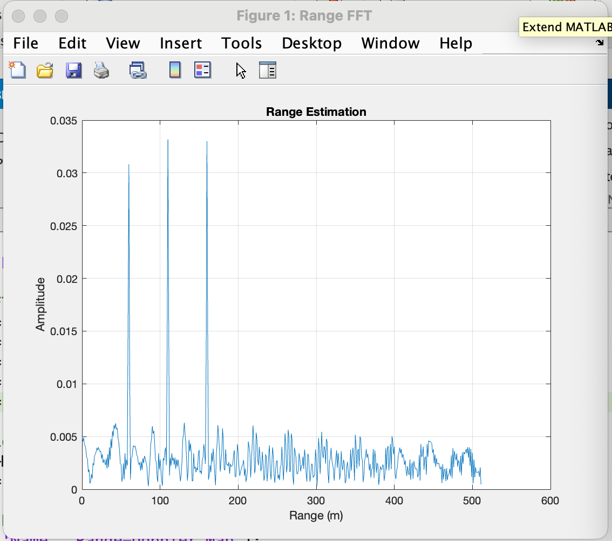

# 📡 FMCW Radar Simulation – Range and Doppler Estimation

This is a simulation of a **Frequency-Modulated Continuous Wave (FMCW) radar system** developed in MATLAB. The system detects **multiple moving targets** and estimates both **range** and **velocity** using signal processing techniques like **FFT**.

---

## 🎯 Objective

The goal was to:
- Simulate how FMCW radar detects moving targets
- Estimate range using **beat signals**
- Extract velocity through **Doppler processing**
- Visualize results in both 1D (range) and 2D (range vs. velocity)

---

## 📐 Radar Configuration

| Parameter             | Value                 |
|----------------------|-----------------------|
| Carrier Frequency     | 77 GHz                |
| Max Range             | 200 m                 |
| Range Resolution      | 1 m                   |
| Max Velocity          | ±100 m/s              |
| Chirp Bandwidth       | 150 MHz (derived)     |
| Chirp Duration        | ~7.33 µs              |
| Sampling per Chirp    | 1024 (Nr)             |
| Chirps in Sequence    | 256 (Nd)              |
| PRF                   | 1 / Tchirp            |

---

## 🧪 Target Simulation

I simulated 3 targets at different positions and speeds:

- Target 1: **60 m**, **–40 m/s**
- Target 2: **110 m**, **+30 m/s**
- Target 3: **160 m**, **0 m/s**

Each target affects the beat signal differently depending on its range and Doppler shift.

---

## 📊 1D FFT – Range Estimation

After mixing Tx and Rx signals, I performed a 1D FFT on the beat signal to extract target distances.

### 🔍 Output:


This plot shows **clear peaks** corresponding to the actual ranges of the targets. Since FFT bins map linearly to time delay, I scaled them to show range in meters.

---

## 🌀 2D FFT – Range-Doppler Map

Then, I reshaped the signal into a 2D matrix and applied a 2D FFT (along time and chirp axes) to extract both **range and velocity**.

### 🔍 Output:


- The x-axis is velocity (Doppler), scaled using PRF and carrier wavelength
- The y-axis is range
- Bright spots show where targets exist with their relative velocity

> **Observation:** While range estimation was accurate, **velocity resolution** was slightly off due to **FFT bin mismatch** and coarse **Doppler calibration**. I’m currently tuning the FFT windowing and PRF parameters to resolve this.

---

## 📌 Code Workflow Summary

```matlab
% 1. Define radar parameters
% 2. Simulate moving targets with Doppler shift
% 3. Generate Tx and Rx chirp signals
% 4. Mix signals to get beat frequency
% 5. Apply windowing and FFT for range and Doppler
% 6. Visualize range and velocity maps
